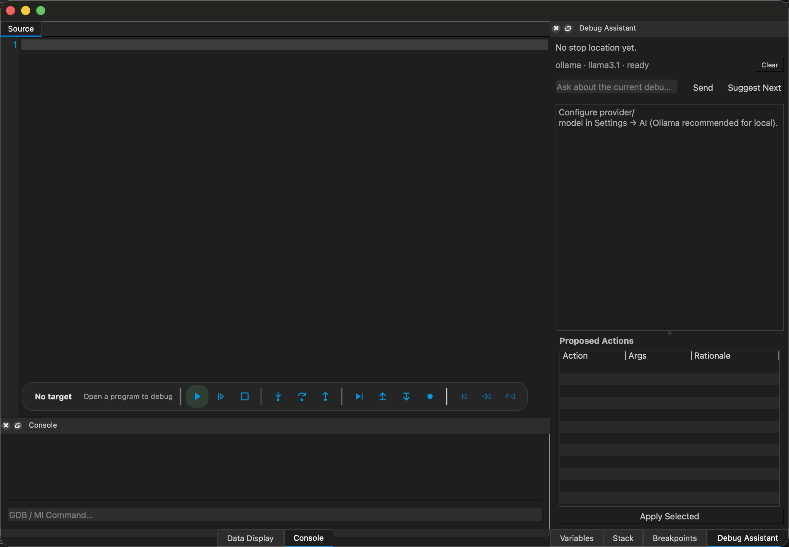

# qddd — Qt Debugger Development Dashboard

qddd is a **Qt-based graphical debugger frontend** focused on
**visualizing complex program state during debugging**.

Instead of presenting variables as plain text,
qddd aims to provide a **structural and graphical view of runtime data**,
making it easier to understand relationships between objects,
pointers, and nested structures.

The project communicates with **GDB through the Machine Interface (MI)** and
is designed with a strict separation between the UI layer and the debugging backend.

> ⚠️ Work in progress / experimental project

---

## Why qddd?

Traditional debuggers are excellent for stepping through code,
but they often become hard to use when dealing with:

- deeply nested structures
- pointer-heavy data models
- complex object graphs
- runtime relationships between variables

qddd focuses on **understanding program state**, not only execution flow.

---

## ✨ Features

- Qt-based desktop UI
- Direct communication with **GDB / MI**
- Interactive debugger console
- Structured variable model
- Expandable hierarchical data visualization
- Graph-style rendering of related variables
- Clear separation between UI and debugger backend

---

## 📸 Screenshot

<p align="center">
  
</p>

*UI and layout are evolving as the project develops.*

---

## 🧩 Architecture Overview

The project is structured around a few core components:

### DebugSession
- Manages the GDB process lifecycle
- Handles MI protocol communication
- Translates debugger events into Qt signals

### ConsoleWidget
- Interactive MI command console
- Displays raw debugger input and output

### Variable Model
- Tree-based representation of debugger variables
- Designed to reflect real memory layouts
- Supports hierarchical expansion and future graph-based extensions

This architecture allows the UI to remain largely independent
from the underlying debugging engine.

---

## 🛠️ Build Requirements

- Qt 5 or Qt 6
- C++17 compatible compiler
- GDB with MI support
- CMake

---

## 🚀 Build & Run

```bash
git clone https://github.com/manux81/qddd.git
cd qddd
mkdir build && cd build
cmake ..
make
./qddd
