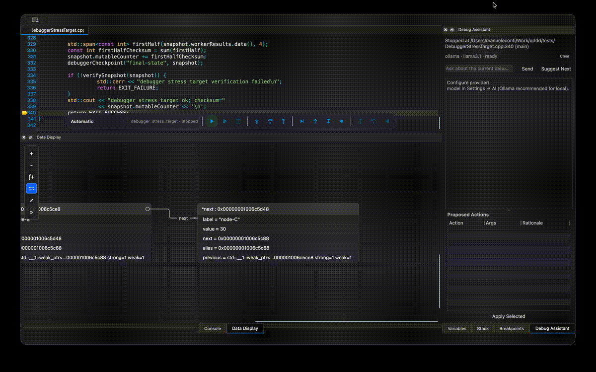

# qddd — Visual Debugger for C/C++

**qddd** is a graphical debugger for C and C++ focused on **visualizing runtime data structures, pointers and object relationships**.

Instead of inspecting complex program state only through traditional variable trees, qddd can turn runtime objects into an **interactive graph** backed by GDB.

<p align="center">
  
</p>

> **See your data structures while they are running.**

---

## Why qddd?

Traditional debuggers are excellent at showing:

- source code
- stack frames
- variables
- registers
- breakpoints

But understanding a pointer-heavy structure often still means mentally reconstructing relationships from addresses and nested trees.

qddd takes a different approach.

Given something as simple as:

```cpp
struct Node {
    int value;
    Node *next;
};
```

qddd can represent the runtime objects and their relationships graphically:

```text
┌──────────────┐        next        ┌──────────────┐
│ Node         │ ─────────────────> │ Node         │
│ value = 10   │                    │ value = 20   │
└──────────────┘                    └──────────────┘
```

The goal is not only to answer:

> What is the value of this variable?

but also:

> What does the program state actually look like?

---

## ✨ Highlights

- **Graphical runtime object visualization**
- Pointer and object relationship tracking
- Runtime identity based on address and debugger type
- Alias detection: multiple references can point to the same graph object
- Cycle protection for recursive data structures
- Interactive hierarchical variable exploration
- Source-level debugging
- Breakpoints, stepping and execution control
- Interactive GDB/MI console
- Local and remote debugging
- Embedded target support
- Qt desktop interface
- C++17 codebase

---

## 📸 Interface

<p align="center">
  
</p>

The graphical Data Display is designed to complement traditional debugger views rather than replace them.

---

## 🧠 Runtime Object Graph

qddd identifies runtime objects using their normalized memory address together with their concrete debugger type.

This means that if two expressions point to the same object, qddd can represent them as **one runtime object with multiple references**, instead of creating duplicate nodes.

For example:

```cpp
Node *head = ...;
Node *selected = head;
```

`head` and `selected` refer to the same runtime object.

This also makes it possible to handle:

- linked lists
- trees
- graphs
- object hierarchies
- aliases
- cyclic structures

Graph refreshes are diffed using object, member and logical reference identity, allowing qddd to track changes without rebuilding the graph purely from UI text.

---

## 🔌 Debugger Backends

| Backend / target | Status | Notes |
| --- | --- | --- |
| **GDB/MI** | ✅ Supported | Primary debugger backend using MI2 |
| **gdbserver** | ✅ Supported | Remote debugging through GDB |
| **LLDB-MI** | 🧪 Experimental | Requires a separately installed `lldb-mi` |
| **ST-Link** | 🧪 Experimental | Can launch `ST-LINK_gdbserver` |
| **SEGGER J-Link** | 🧪 Experimental | Managed GDB-server profile |
| **MPLAB MDB** | 🧪 Experimental | PICkit Basic / PICkit 5 and dsPIC support |

---

## 🎯 Embedded & Remote Debugging

qddd can connect to remote targets through GDB using:

```text
target remote
```

or:

```text
extended-remote
```

Supported workflows include:

- generic `gdbserver`
- STMicroelectronics ST-Link
- SEGGER J-Link
- MPLAB MDB / PICkit

For a remote GDB target:

```text
File → Settings… → Target
```

Select:

```text
Remote gdbserver
```

or:

```text
J-Link
```

then configure the target host and port.

Open the local ELF file to load symbols and start debugging.

---

## 🛠 Build Requirements

- Qt 5
  - Core
  - Gui
  - Widgets
  - Network
- C++17 compatible compiler
- GDB with MI support
- CMake

Qt 6 is not currently a documented build target.

---

## 🚀 Build & Run

```bash
git clone https://github.com/manux81/qddd.git
cd qddd

cmake -S . -B build \
  -DCMAKE_BUILD_TYPE=Release \
  -DBUILD_TESTING=ON

cmake --build build --parallel
```

Run on Linux:

```bash
./build/src/qddd
```

On macOS the application is built inside:

```text
build/src/qddd.app
```

---

## 📦 Releases

Pre-built packages are available from the GitHub **Releases** section.

Release builds are generated for:

- Linux
- Windows
- macOS

Windows and macOS archives include the Qt runtime.

The current Linux archive expects Qt 5 runtime libraries to already be installed.

macOS packages are currently unsigned and not notarized.

---

## 🧪 Tests

Run the automated test suite with:

```bash
ctest --test-dir build --output-on-failure
```

Tests currently cover areas including:

- GDB/MI stream reconstruction
- debugger command lifecycle
- runtime object graph
- MPLAB MDB process protocol

The automated tests do not require debugger hardware.

GitHub Actions builds and tests qddd on every push and pull request.

---

## 🏗 Architecture

qddd keeps the debugger backend separated from the UI.

### DebugSession

Responsible for:

- GDB process lifecycle
- MI protocol communication
- debugger commands
- debugger events

### Variable Model

Provides:

- hierarchical debugger variables
- runtime object identity
- member relationships
- graph representation

### ConsoleWidget

Provides direct access to debugger communication and MI commands.

This separation makes it possible to evolve the graphical debugger independently from the underlying debugging transport.

---

## 🤝 Contributing

qddd is under active development and contributions are welcome.

Useful contributions include:

- testing qddd on different Linux distributions
- testing remote GDB targets
- testing embedded hardware
- improving the graphical Data Display
- UI/UX improvements
- debugger backend improvements
- bug reports
- documentation

If you find something interesting, broken or confusing, please **open an issue**.

Even small bug reports and test results are useful.

---

## ⭐ Help the Project

If qddd looks useful to you:

- ⭐ Star the repository
- 🐛 Open an issue
- 🧪 Try it on your project
- 💬 Share feedback
- 🔧 Submit a pull request

qddd is still evolving, and real-world debugger use cases are particularly valuable.

---

## Status

qddd is currently an **experimental but usable project under active development**.

The focus is on exploring a more visual way to understand complex C/C++ runtime state while retaining the power of GDB underneath.
